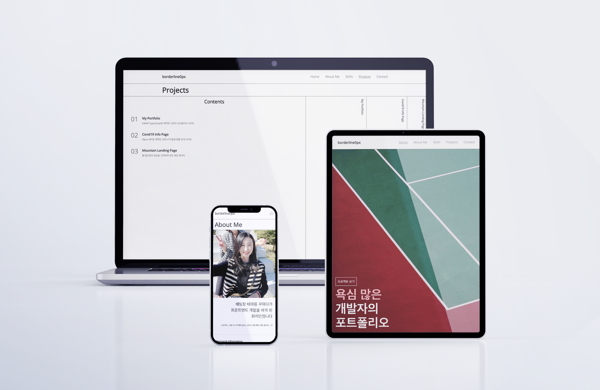

# My Portfolio

CRA와 TypeScript로 제작된 개인 포트폴리오 사이트 입니다.

📎 web page: [https://my-portfolio-1068b.web.app](https://my-portfolio-1068b.web.app/)

## summary

- stack: React(CRA) hooks, styled-components, TypeScript
- SEO: react-helmet, react-snap
- 반응형
- deployment: firebase
- 제작 동기: 신입 프론트엔드 개발자로서 개인 프로젝트들을 업로드할 공간을 마련하기 위해 제작하였습니다.

## 포인트

- Image CDN(Cloudinary)를 활용하여, 최적화 된 이미지를 보여주고자 하였습니다.
- 뷰포트에 따라 반응형으로 이미지가 로드될 수 있도록 하였습니다.
- react-snap를 사용하여, 동적 페이지 렌더링으로 인한 검색 노출의 한계를 보완하였습니다.
- 각 페이지 당 lazy loading을 통하여, 필요한 리소스를 적절하게 받아올 수 있도록 하였습니다.

## 개선해야 할 사항

- 각 페이지의 이미지 다운로드 속도를 개선할 것
- 재활용성 및 유지 보수성을 위해 코드 구조를 리팩토링
- SSR로 재구성해보고자 함
- 개인 도메인 연결할 예정

---

<a href="[https://kr.freepik.com/psd/mockup](https://kr.freepik.com/psd/mockup)">Mockup psd는 syifa5610 - kr.freepik.com가 제작함</a>
